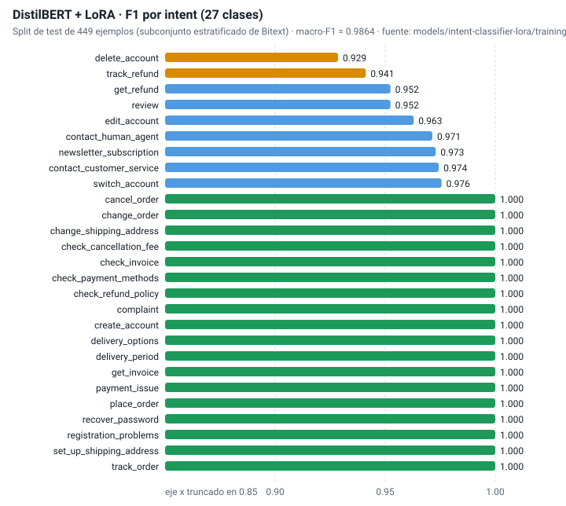
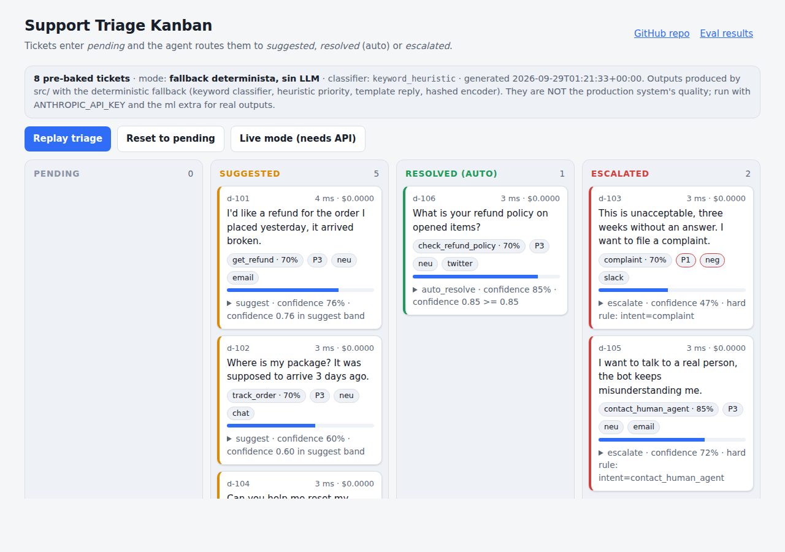

# Customer Support Triage Agent

[](https://github.com/Juadsuarezsan/support-triage-agent/actions/workflows/ci.yml)
[](eval/RESULTS.md)
[](LICENSE)
[](pyproject.toml)
[](src/config.py)
[-2f6df6)](demo/index.html)

**Demo:** abre [`demo/index.html`](demo/index.html) servido por HTTP (`python -m http.server -d demo 8080`) o
[lánzalo con el API](#quickstart) para verlo en vivo. El despliegue público está pendiente de una cuenta de hosting.

## Qué hace este proyecto

Recibe un ticket de soporte (email, chat, Slack o Twitter), entiende qué pide el
cliente y con qué urgencia, busca cómo se resolvieron tickets parecidos y
redacta una respuesta. Después decide si la respuesta puede enviarse sola, si un
agente debe revisarla o si el caso hay que escalarlo. Cada decisión queda
registrada con sus puntuaciones, tokens, costo y latencia.

## Caso de uso industrial

Cualquier equipo de soporte que use Zendesk, Intercom, Freshdesk o HubSpot y
reciba más tickets de los que puede leer a mano. Ejemplos concretos:

- Un e-commerce con 2.000 tickets/día donde el 40 % son "¿dónde está mi pedido?"
  y "¿cuál es la política de devoluciones?": esos se cierran solos con la
  respuesta estándar y el enlace de seguimiento.
- Un SaaS B2B donde un ticket con "production is down" debe saltar la cola y
  llegar a un ingeniero en minutos, no cuando un agente lo abra.
- Un equipo con obligaciones GDPR donde "borra mis datos" nunca debe recibir una
  respuesta automática.

## Arquitectura


Seis nodos LangGraph: `classify_intent` (DistilBERT+LoRA fine-tuneado sobre
Bitext, 27 intents) → `analyze_priority` (Claude, JSON estructurado) →
`retrieve_similar` (`all-mpnet-base-v2` + Qdrant) → `draft_solution` (Claude
con evidencia) → `decide_route` (reglas puras: `score = 0.5·intent +
0.4·similitud + 0.1 − penalizaciones`, con reglas duras para quejas y "quiero
un humano") → `record_audit` (Postgres). Detalles en
[`docs/architecture.md`](docs/architecture.md).

Sin `ANTHROPIC_API_KEY` ni el extra `ml`, cada componente usa un fallback
determinista (clasificador por palabras clave, heurística de prioridad,
plantilla de respuesta, encoder hash). Ese modo existe para CI, tests y demos
y se etiqueta como tal en todos los reportes; **no es el sistema en
producción**.

## Métricas y resultados

Tabla obligatoria del spec, regenerada por `python -m eval.run` desde
[`eval/RESULTS.md`](eval/RESULTS.md). Solo se publican números que provienen
de un archivo en `eval/runs/`.

| Sistema | Macro-F1 | Auto-resolve | Latencia p95 | Costo/ticket |
|---|---|---|---|---|
| Zero-shot Claude | pendiente (requiere ANTHROPIC_API_KEY) | pendiente | pendiente | pendiente |
| DistilBERT fine-tuneado solo | pendiente (requiere extra `ml` + pesos) | — | pendiente | pendiente |
| Híbrido (este sistema) | pendiente (requiere ANTHROPIC_API_KEY + extra `ml`) | pendiente | pendiente | pendiente |
| Fallback determinista, sin LLM — *no es el sistema* | 0.948 | 0.0 % | 3 ms | $0.0000 |

Sobre el eval set de 108 tickets sintéticos escritos a mano (4 por intent;
`data/eval/queries.jsonl`, ground truth manual). El fallback acierta el intent
por palabras clave pero **no auto-resuelve nada** (decision agreement 49.1 %,
false-escalation 17.9 %): sin encoder semántico, el término de similitud es
ruido, como muestra la ablación en `eval/RESULTS.md`.

**Clasificador fine-tuneado** (`models/intent-classifier-lora/training_metrics.json`,
métrica versionada de la corrida de entrenamiento, no de este eval set):
macro-F1 **0.9864** sobre el split de test de **449 ejemplos** de un
subconjunto estratificado de 4.482 filas de Bitext; 18 de 27 clases con F1 =
1.0. Los pesos del adapter no están en el repo; su publicación en HF Hub y el
reentrenamiento sobre el 10 % completo (2.687 ejemplos) están pendientes de
red a Hugging Face.



Análisis de los diez intents con peor F1 y de los fallos del pipeline:
[`docs/error_analysis.md`](docs/error_analysis.md).

## Quickstart

```bash
git clone https://github.com/Juadsuarezsan/support-triage-agent && cd support-triage-agent
make install                      # venv + pip install -e ".[dev]"  (sin torch)
make test lint typecheck          # pytest --cov (96.8 %), ruff, black, mypy --strict
make eval                         # python -m eval.run -> eval/runs/*.json + eval/RESULTS.md
make serve                        # uvicorn en :8000; luego abre demo/index.html en "Live mode"
```

Con llave y modelo real:

```bash
cp .env.example .env              # ANTHROPIC_API_KEY, USE_LOCAL_CLASSIFIER=true, ENCODER_BACKEND=hf
pip install -e ".[dev,ml]"        # torch + transformers + peft + sentence-transformers
python -m eval.run --systems zero_shot_claude distilbert_only hybrid --judge
docker compose up                 # postgres + qdrant + api (pendiente de validar sin demonio Docker aquí)
```

Ejemplo de llamada:

```bash
curl -s localhost:8000/api/triage -H 'Content-Type: application/json' \
  -d '{"ticket_id":"t-1","channel":"chat","body":"I was charged twice for the same order"}' | jq .decision
```

## Demo



Ocho tickets pre-horneados por `scripts/bake_demo_predictions.py` con el
pipeline del repo (modo fallback, declarado en la página) recorren
*pending → suggested / resolved / escalated*. El modo en vivo llama a
`POST /api/triage`, `GET /health` y `GET /api/audit/recent`. Responsive a
375 px (`docs/demo_kanban_mobile.png`), sin CDN.

## Decisiones técnicas

Resumen de [`docs/decisions.md`](docs/decisions.md):

1. **DistilBERT+LoRA para el intent, Claude para matices y redacción**: la
   clasificación cerrada de 27 clases no necesita un LLM por ticket; el adapter
   corre en ~50-110 ms en CPU y sin costo por token.
2. **LoRA r=8 y no fine-tune completo**: 750 K parámetros entrenables, 199 s en
   CPU, adapter de pocos MB versionable aparte del modelo base.
3. **Qdrant y no Chroma/pgvector**: filtrado por payload, snapshots, cliente
   async tipado y aislamiento respecto del Postgres transaccional.
4. **Umbrales 0.85/0.60 con reglas duras antes del score**: auto-resolver exige
   intent alto *y* una resolución previa muy parecida; quejas y "quiero un
   humano" escalan siempre.
5. **LangGraph con estado tipado**: nodos con nombre de verbo (la colisión
   nodo/clave era el bug que impedía arrancar), trazas por nodo y camino
   directo a LangSmith.
6. **Cliente `anthropic` único** con timeout, `tenacity` y contabilidad de
   tokens, mockeado con `respx` en tests.
7. **Fallback determinista etiquetado** en JSON, `RESULTS.md` y demo.

## Limitaciones conocidas

- **No hay corrida con el sistema real**: las filas Zero-shot, DistilBERT-solo e
  Híbrido están pendientes de `ANTHROPIC_API_KEY` y del extra `ml`.
- **El eval set es sintético** (108 tickets escritos a mano). Un ticket real
  con typos, emojis o en otro idioma degradará al clasificador entrenado sobre
  las plantillas de Bitext.
- **Las métricas del clasificador son sobre 449 ejemplos** (~17 por clase): un
  error mueve el F1 de una clase ~0.06.
- **Los pesos del adapter no están publicados**; sin ellos el servicio cae al
  zero-shot (con llave) o al fallback léxico.
- **Latencia**: dos llamadas a Claude en serie dominan el p95 (estimado 4-7 s).
- **`docker compose up`** no se ha validado en esta fase (sin demonio Docker).
- **Sin LangSmith activo**: el cableado existe por variables de entorno; no hay
  traces públicas todavía.

## Trabajo futuro

1. Correr `python -m eval.run --systems zero_shot_claude distilbert_only hybrid --judge`
   con llave y publicar los pesos del adapter en HF Hub con la model card.
2. Reentrenar sobre el split completo (21.497 / 2.687 / 2.687) y guardar la
   matriz de confusión (`confusion_matrix.json`, ya soportada por el script de
   gráficos).
3. Paralelizar `analyze_priority` y `retrieve_similar`, y saltar el drafter en
   escalaciones por regla dura.
4. Muestra de 200 conversaciones de Twitter como segundo eval set (texto real,
   multi-turno).
5. Frontend Next.js + shadcn/ui sobre `/api/audit/recent` con websocket y
   despliegue público con LangSmith.

## Estructura del repositorio

```
src/api           FastAPI (create_app, schemas, CORS por env, slowapi)
src/agents        orquestador LangGraph, prioridad/sentimiento, drafter, decisión
src/classifier    DistilBERT+LoRA (lazy), zero-shot Claude, heurística
src/retrieval     encoders (hash, mpnet, cache), store en memoria, Qdrant
src/persistence   audit log en memoria y Postgres (psycopg pool)
src/llm           ClaudeClient (timeout, tenacity, tokens, JSON estricto)
src/eval          métricas, runner, juez con rúbrica, baselines, reporte
eval/run.py       python -m eval.run  -> eval/runs/*.json, eval/RESULTS.md
data/eval         108 tickets sintéticos + 15 semillas resueltas; MANIFEST.txt
scripts/          download_data, make_splits, bake_demo_predictions, plots, notebooks
models/           adapter config, tokenizer, label mapping, métricas de entrenamiento
docs/             arquitectura, decisiones, escalabilidad, rendimiento, errores, datos, blog
demo/             Kanban estático + predictions.json
notebooks/        demo.ipynb, 02_eval_pipeline.ipynb, 03_baselines_comparison.ipynb
```

## Datos

- Bitext Customer Support (Hugging Face, CC BY 4.0):
  `https://huggingface.co/datasets/bitext/Bitext-customer-support-llm-chatbot-training-dataset`
- Customer Support on Twitter (Kaggle, CC BY-NC-SA 4.0):
  `https://www.kaggle.com/datasets/thoughtvector/customer-support-on-twitter`
- `python scripts/download_data.py --all` descarga ambos y escribe SHA-256 en
  `data/MANIFEST.txt`; `python scripts/make_splits.py` genera los splits
  80/10/10 con seed 20260516. Esquema en [`docs/data_schema.md`](docs/data_schema.md).

## Seguridad

CORS por `CORS_ORIGINS` (nunca `*`), rate limiting con `slowapi`
(`RATE_LIMIT`), validación Pydantic con 422 para cuerpos vacíos, mayores de
5.000 caracteres o mal formados, secretos solo en `.env`. `gitleaks detect
--no-banner --redact` sobre el repo: **sin hallazgos** (2026-09-29); también
corre en CI.

## Autor

Juan David Suárez Sánchez · juadsuarezsan@unal.edu.co ·
[LinkedIn](https://www.linkedin.com/in/juan-david-suarez-sanchez-31ab281b7)

Licencia MIT ([`LICENSE`](LICENSE)).
