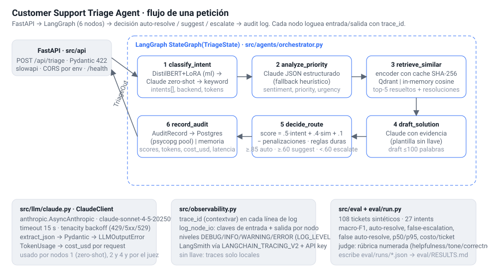

# Arquitectura

## Resumen

Un ticket entra por `POST /api/triage`, atraviesa un grafo LangGraph de seis
nodos y sale con intent, prioridad, sentimiento, tickets similares, un borrador
de respuesta y una decisión de enrutamiento (`auto_resolve` / `suggest` /
`escalate`). Cada nodo escribe su salida en un estado tipado; el último nodo
persiste una fila de auditoría con scores, tokens, costo y latencia.

## Capas y carpetas

| Capa | Carpeta | Conoce a | No conoce a |
|---|---|---|---|
| Transporte HTTP | `src/api/` | Pydantic, `TriagePipeline` | Claude, Qdrant, Postgres |
| Orquestación | `src/agents/orchestrator.py` | los protocolos de abajo | HTTP |
| Dominio | `src/agents/`, `src/classifier/` | `ClaudeClient`, esquemas | FastAPI, drivers |
| Infraestructura | `src/retrieval/`, `src/persistence/`, `src/llm/` | SDKs (anthropic, qdrant-client, psycopg) | reglas de negocio |
| Configuración | `src/config.py` | variables de entorno | todo lo demás |
| Evaluación | `src/eval/`, `eval/run.py` | el dominio y `data/eval/` | el API en tiempo de petición |

Las dependencias van hacia abajo: el API construye los backends a partir de
`Settings` en el `lifespan` y los inyecta en `build_pipeline`. Los tests
construyen el mismo pipeline con dobles (`respx` para Claude, `AsyncMock` para
Qdrant, un pool falso para Postgres).

## El grafo

`TriageState` es un `TypedDict` con `total=False`. Los nombres de nodo llevan
verbo (`classify_intent`, `analyze_priority`, ...) porque LangGraph rechaza un
nodo cuyo nombre coincida con una clave del estado; ese fue el bug que impedía
arrancar el API antes de esta fase.

| # | Nodo | Entrada | Salida | Backend real | Fallback sin llave |
|---|---|---|---|---|---|
| 1 | `classify_intent` | `body` | `intents[]`, `classifier_backend`, tokens | DistilBERT+LoRA (`ml`) o Claude zero-shot | `KeywordHeuristicClassifier` (27 reglas) |
| 2 | `analyze_priority` | `body` | `priority`, `sentiment`, `urgency_score`, `rationale`, tokens | Claude, JSON validado con Pydantic | heurística por palabras clave |
| 3 | `retrieve_similar` | `body` | `similar[]` (top-5) | `all-mpnet-base-v2` + Qdrant | encoder hash + coseno en memoria |
| 4 | `draft_solution` | `body`, `similar` | `draft`, tokens | Claude con evidencia | plantilla con la resolución top |
| 5 | `decide_route` | `intents`, `similar`, `sentiment`, `urgency_score` | `decision`, `latency_ms` | reglas puras | (mismas reglas) |
| 6 | `record_audit` | todo | `cost_usd` | Postgres (`psycopg_pool`) | ring buffer en memoria |

Los nodos 2 y 3 son independientes entre sí; hoy corren en secuencia por
claridad del trace. Ver `docs/performance.md` para el plan de paralelizarlos.

## Cliente Claude compartido

`src/llm/claude.py` es el único punto que toca el SDK. Envuelve
`anthropic.AsyncAnthropic` con `timeout=15 s`, `max_retries=0` (los reintentos
los gobierna `tenacity` con backoff exponencial 1-8 s sobre 429, 5xx, 529 y
timeouts), devuelve `LLMResult(text, usage, model, stop_reason)` y expone
`extract_json` / `parse_model`, que convierten una respuesta mal formada en
`LLMOutputError` en vez de un `KeyError` en medio del grafo.

## Observabilidad

- `trace_id` por petición en un `ContextVar`, inyectado en el formato de loguru
  (`trace=<id>`), devuelto en `TriageOut` y guardado en la fila de auditoría.
- `log_node_io` emite en DEBUG las claves que leyó cada nodo y un resumen de lo
  que escribió.
- Tokens de entrada/salida y `cost_usd` se acumulan en el estado y se reportan
  por petición; el precio por millón de tokens es configurable.
- LangSmith: LangGraph envía traces cuando `LANGCHAIN_TRACING_V2=true` y hay
  `LANGCHAIN_API_KEY`; no se ha ejecutado en esta fase (sin llave).

## Datos en reposo

| Dato | Backend | Esquema |
|---|---|---|
| Tickets resueltos (base de conocimiento) | Qdrant (`resolved_tickets`, coseno) o memoria | payload `ticket_id, intent, body, resolution`; id = UUID5 del `ticket_id` |
| Auditoría | Postgres (`tickets`, `triage_audit`) o memoria | ver `SCHEMA_SQL` en `src/persistence/audit.py` |
| Eval set y semillas | JSONL versionado | `docs/data_schema.md` |
| Corridas de evaluación | `eval/runs/*.json` | `EvalReport` |

## Qué no está en esta fase

- El clasificador fine-tuneado se carga solo con el extra `ml`; los pesos del
  adapter no están en el repo y su publicación en HF Hub está pendiente.
- El frontend Next.js del spec se sustituye por `demo/index.html`, que consume
  los mismos endpoints (`/api/triage`, `/api/audit/recent`).
